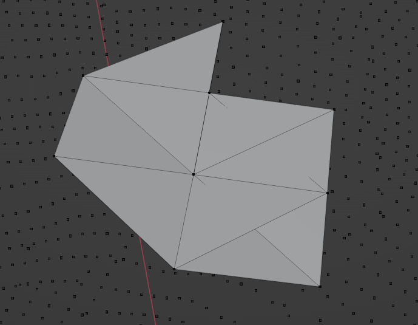
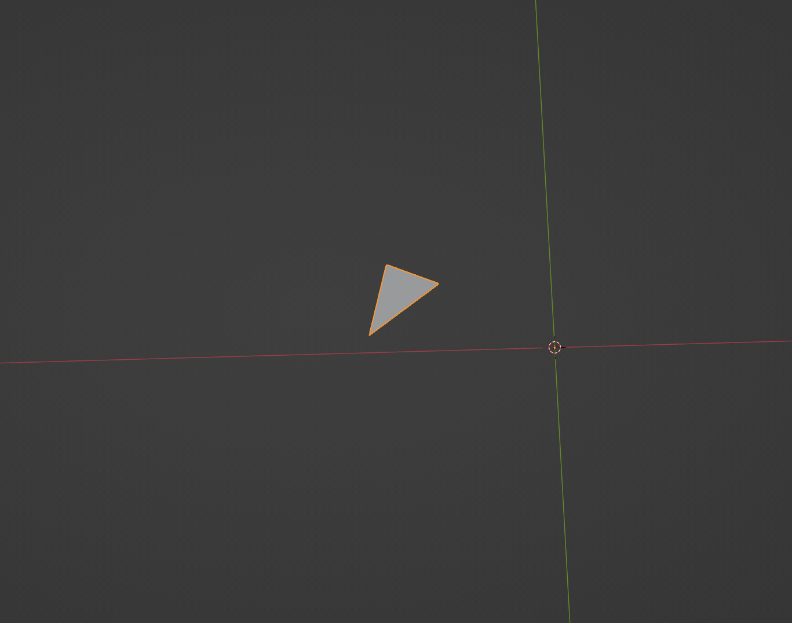

# Notes

## 0.0.1
Starting with the creation of this notes file I am recording the version number of the project. This will be the first version of the project as I haven't recorded numbers previously.

This version introduced:
* 

From the previous version where we had:
* 